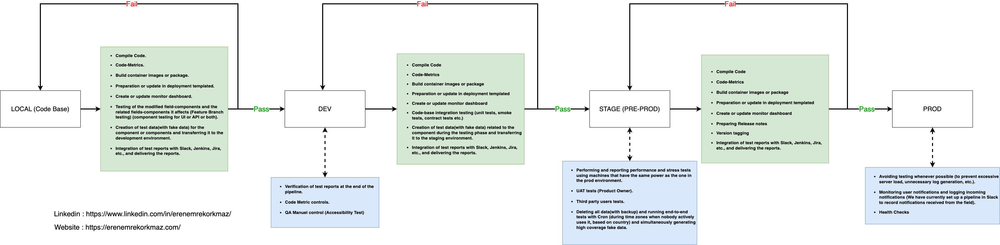

# Playwright TS Boiler Plate

A brief description of what this project does and who it's for

## Quick Start

To create a project, simply run:

```bash
npx playwright-structure-ts <project-name>
```

Or

```bash
npm init playwright-structure-ts <project-name>
```

## Installation

Clone the repo:

```bash
git clone --depth 1 https://github.com/erenkorkmazemre/playwright-structure-ts
cd playwright-structure-ts
```

Install the dependencies:

```bash
npm install
```

Set the environment variables:

```bash
cp .env.example .env
# open .env and modify the environment variables (Talk to Eren Emre Korkmaz for local tests(you need franchise username and password) !!!!!!!)
```

## Technologies

-   Node.js (10.16.3)
-   Faker-js (7.6.0)
-   Playwright/test (1.35.1)
-   Eslint (8.44.0)
-   Dotenv (16.0.3)
-   Prettier (2.8.8)
-   Docker
-   Jenkins
-   Winston (3.8.2)

## Structure

```
project/                          # Source code.
├── tests/                        # This folder contains your tests.
│   ├── e2e/                      # This folder contains E2E (end-to-end) tests. Tests that simulate user interactions using browser automation tools are placed here.
│   │   ├── login.spec.ts
│   │   ├── home.spec.ts
│   │   └── ...
│   ├── integration/               # This folder contains integration tests. It is used to test the interaction between components, services, and other pieces of source code.
│   │   ├── footer.spec.ts
│   │   ├── header.spec.ts
│   │   └── ...
│   ├── unit/                     #
│   │   ├── utils.spec.ts
│   │   ├── services.spec.ts
│   │   └── ...
│   ├── types/                    #
│   │   ├── utils.spec.ts
│   │   ├── services.spec.ts
│   │   └── ...
│   └── ...
├── actions/                      # This directory contains page object files that define the elements and actions on specific pages of your application. Each page object file represents a different page or a component of your application.
│   ├── pages/
│   │   ├── LoginPage.ts
│   │   ├── HomePage.ts
│   │   └── ...
│   └── ...
├── locators/                     # This directory contains locator files that define the selectors or locators for specific elements on the pages of your application. Each locator file corresponds to a particular page or component and contains variables or functions that return the selectors for elements on that page.
│   ├── loginLocators.ts
│   ├── homeLocators.ts
│   └── ...
├── utils/                        # This directory houses utility files, such as helper functions, configuration files, or custom modules that provide commonly used functionalities across your tests.
│   ├── endpoints/                #
│   │   ├── asdasd.ts
│   │   └── ...
│   ├── urls/                     #
│   │   ├── asdasd.ts
│   │   └── ...
│   ├── helpers.ts                #
│   ├── configurations.ts         #
│   ├── logger.ts                 #
│   └── ...
├── data/                         #
│   ├── mocks/                    #
│   │   ├── dynamic/              #
│   │   │   ├── endpoint-1.ts
│   │   │   ├── endpoint-2.ts
│   │   │   └── ...
│   │   ├── static/               #
│   │   │   ├── endpoint-1.json
│   │   │   ├── endpoint-2.json
│   │   │   └── ...
│   │   └── ...
│   └── ...
├── playwright-report/            #
│   ├── index.html                #
│   └── ...
├── test-results/                 #
│   ├── index.html                #
│   └── ...
├── scripts/                      #
│   ├── cron-slack.sh             #
│   ├── trigger-slack.sh          #
│   ├── trigger-jenkins.sh        #
│   └── ...
├── playwright.config.ts          #
├── .env                          #
├── .env.example                  #
├── bitbucket-pipelines.yml       #
├── Jenkinsfile                   #
├── package.json                  #
├── tsconfig.json                 #
└── README.md                     #

```

## Deployment Process

The deployment process also includes the pipeline processes involved in the project.



### The steps when the pipeline is triggered

```
LOCAL(CODE-BASE) => DEV
- Compile Code.
- Code-Metrics.
- Build container images or package.
- Preparation or update in deployment templated.
- Create or update monitor dashboard.
- Testing of the modified field-components and the related fields-components it affects (Feature Branch testing) (component testing for UI or API or both).
- Creation of test data(with fake data) for the component or components and transferring it to the development environment.
- Integration of test reports with Slack, Jenkins, Jira, etc., and delivering the reports.
```

```
DEV => STAGE(PRE-PROD)
- Compile Code
- Code-Metrics
- Build container images or package
- Preparation or update in deployment templated
- Create or update monitor dashboard
- Code-base integration testing (unit tests, smoke tests, contract tests etc.)
- Creation of test data(with fake data) related to the component during the testing phase and transferring it to the staging environment.
- Integration of test reports with Slack, Jenkins, Jira, etc., and delivering the reports.
```

```
STAGE(PRE-PROD) => PROD
- Compile Code
- Code-Metrics
- Build container images or package
- Preparation or update in deployment templated
- Create or update monitor dashboard
- Preparing Release notesVersion taggingIntegration of test reports with Slack, Jenkins, Jira, etc., and delivering the reports.
```

### The steps in the environments

```
In DEV env
- Verification of test reports at the end of the pipeline.
- Code Metric controls.
- QA Manuel control (Accessibility Test)
```

```
In STAGE(PRE-PROD) env
- Performing and reporting performance and stress tests using machines that have the same power as the one in the prod environment.
- UAT tests (Product Owner).
- Third party users tests.
- Deleting all data(with backup) and running end-to-end tests with Cron (during time zones when nobody actively uses it, based on country) and simultaneously generating high coverage fake data.
```

```
In PROD env
- Avoiding testing whenever possible (to prevent excessive server load, unnecessary log generation, etc.).
- Monitoring user notifications and logging incoming notifications (We have currently set up a pipeline in Slack to record notifications received from the field).
- vHealth Checks
```

## Logger

A winston logger with custom format is used. This logger is registered into the dependency injection container.
Import the logger from `utils/logger.ts`. It is using the [Winston](https://github.com/winstonjs/winston) logging library.

Logging should be done according to the following severity levels (ascending order from most important to least important):

```javascript
import logger from '@utils/logger';

logger.error('message'); // level 0
logger.warn('message'); // level 1
logger.info('message'); // level 2
logger.http('message'); // level 3
logger.verbose('message'); // level 4
logger.debug('message'); // level 5
```

Example logging:

```javascript
logger.info('stepDefinition', { additional: 'info' });
```

## Reports

## Testing

Tags, deployment process etc

### - For Local Test

docker-compose up
docker-compose -f docker-compose.yml up
docker-compose -f docker-compose.dev.yml up
docker-compose -f docker-compose.stage.yml up

```

```

### - For Local Parallel Test

```

```

### - For Remote Docker Parallel Test

```

```

## Linting

Linting is done using [ESLint](https://eslint.org/) and [Prettier](https://prettier.io).

To modify the ESLint configuration, update the `.eslintrc.json` file. To modify the Prettier configuration, update the `.prettierrc.json` file.

To prevent a certain file or directory from being linted, add it to `.eslintignore` and `.prettierignore`.

To maintain a consistent coding style across different IDEs, the project contains `.editorconfig`

## Authors

-   [Github](https://github.com/erenkorkmazemre)
-   [Website](https://erenemrekorkmaz.com/)

## Badges

[](https://choosealicense.com/licenses/mit/)
[](https://opensource.org/licenses/)
[](http://www.gnu.org/licenses/agpl-3.0)
